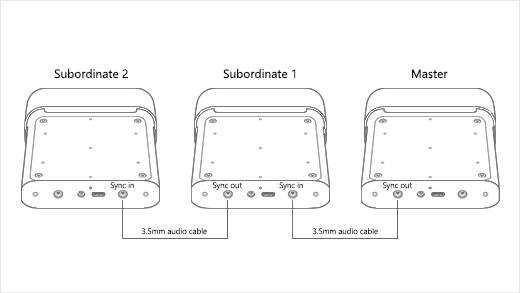

# Azure Kinect 分布式录制工具

本仓库用于 Azure Kinect 多设备同步录制及相关工具集。

## 功能概览

1. 同步录制
2. 帧导出 + 对齐
3. 提取内外参
4. 手动二次对齐（非必需）

## 1. 环境准备

### 1.1 建议环境

- Windows 操作系统
- Python ≥ 3.8

### 1.2 创建 conda 环境

```bash
conda create -n kinect python=3.10
conda activate kinect
```

### 1.3 安装 pyk4a 库

1. 安装 [Azure Kinect SDK v1.4.2](https://download.microsoft.com/download/d/c/1/dc1f8a76-1ef2-4a1a-ac89-a7e22b3da491/Azure%20Kinect%20SDK%201.4.2.exe)

默认 SDK 安装路径为 `C:\Program Files\Azure Kinect SDK v1.4.2`。

2. 安装 pyk4a

```bash
pip install pyk4a
```

如遇问题，请参考 [pyk4a 官方仓库](https://github.com/etiennedub/pyk4a)。

### 1.4 安装其他环境

```bash
pip install -r requirements.txt
```

## 2. 前置知识

### 2.1 节点

`node` / 节点：每台电脑被抽象为一个节点，每个节点可以连接多个相机（不建议超过 3 台）。

### 2.2 多相机硬件同步

所有相机（即使分布在不同节点上）都必须通过 3.5 mm 数据线进行硬件同步，并串行连接所有相机。

连接方式如下：

1. 使用 3.5 mm 数据线连接第一台相机的 `out` 口和第二台相机的 `in` 口。
2. 再使用第二根数据线连接第二台相机的 `out` 口和第三台相机的 `in` 口。
3. 后续相机以此类推。
4. 最后一台相机只有 `in` 口连接数据线，`out` 口闲置。
5. 第一台相机的 `in` 口闲置，并作为 master 相机。

示意图如下：



### 2.3 时间戳

本项目中主要涉及两类时间戳：

1. 相机时间戳 / device timestamp

相机时间戳是各相机进行同步时参考的时间戳，以相机启动时间为基准。Master 相机初始化后，会通过 3.5 mm 数据线将 device time 传递到从属相机（Subordinate），从而实现相机时间戳的硬件对齐。

2. 系统时间戳 / system timestamp

系统时间戳来自各节点电脑的系统时间，主要用于和其他传感器数据进行同步。不同节点的系统时间戳不一定完全一致，可能存在细微差异，因此最终的 csv 文件会在系统时间戳中附带 node tag，用于区分其所属节点。

## 3. 录制

### 3.1 支持模式

本项目支持：

1. 单节点多相机
2. 多节点多相机

### 3.2 单节点多相机

对于单节点多相机，需要在 `config/config.yaml` 中设置：

```yaml
record:
  master_serial: "xxx"  # 替换为实际的主相机
  start_rank: 1         # 第一个非master相机距离master的距离为1
  machine_tag: "node0"  # 只有一台电脑，记为node0即可
```

运行时直接使用：

```bash
python multi_record.py
```

程序默认进入预览状态，可用于调整相机位置、桌面等。

在终端输入 `r` 开始录制。为确保外参一致，录制期间非常不建议移动桌面或相机。

输入 `s` 停止录制并退出。

### 3.3 多节点多相机

对于多节点多相机，需要在每个节点的 `config/config.yaml` 中设置：

#### 节点 0

```yaml
record:
  master_serial: "xxx"  # 替换为实际的主相机
  start_rank: 1         # 节点0的第一个非master相机距离master的距离为1
  machine_tag: "node0"  # 记为node0
```

#### 节点 1

```yaml
record:
  master_serial: "xxx"  # 替换为实际的主相机
  start_rank: xx        # 替换为该节点的第一台相机距离master的距离
  machine_tag: "node1"  # 记为node1
```

#### 节点 2 及后续节点

以此类推。

### 3.4 多节点启动顺序

运行时需要倒序启动。例如有三个节点 `node0`、`node1`、`node2`，需要先在 `node2` 上运行：

```bash
python multi_record.py
```

看到终端信息初始化成功后，再在 `node1` 上运行 `python multi_record.py`，最后在 `node0` 上运行 `python multi_record.py`。

正常情况下，在 `node0` 上运行 `python multi_record.py` 后，所有 node 的屏幕上都会出现预览窗口，此期间可用于调整相机位置等。

### 3.5 多节点录制与停止

- 录制：每台 node 节点电脑都要按 `r` 开始录制，不需要同步按。
- 停止：每台 node 节点电脑都要按 `s` 停止录制并退出，不需要同步按。

## 4. 数据对齐

### 4.1 配置与数据整理

先配置 `config/process_mkv.yaml`，并按实际情况修改 `run_dir`。如果是多节点录制，需要通过云盘或硬盘将所有 mkv + csv 数据拷贝到同一台 node 机器上。由于各个 node 节点开始录制的时刻可能存在细微差异，`run_dir` 下所有 mkv 和 csv 文件的时间戳前缀可能略有不同，需要手动重命名为统一的时间戳。

最终期望的 `run_dir` 格式如下所示，此时 `run_dir = "recordings/20260401_123456"`：

```text
recordings/
    20260401_123456/
        20260401_123456_<device_serial_1>.mkv
        20260401_123456_<device_serial_1>_system_timestamps.csv
        20260401_123456_<device_serial_2>.mkv
        20260401_123456_<device_serial_2>_system_timestamps.csv
        20260401_123456_<device_serial_n>.mkv
        20260401_123456_<device_serial_n>_system_timestamps.csv
```

### 4.2 运行对齐脚本

运行以下命令即可根据 device 时间戳进行精准帧对齐：

```bash
python tools/process_multi_mkv.py
```

## 5. 提取内外参

TODO

## 6. 手动二次对齐（特殊情况，一般不用）

TODO

## 7. 打包为 dataset

TODO
